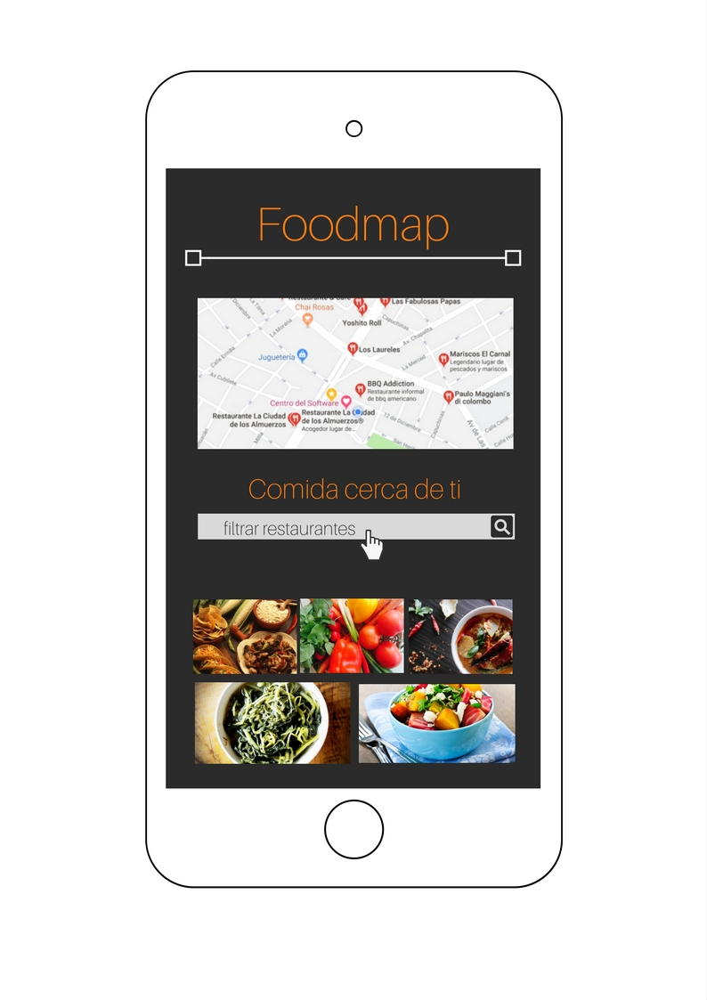

## FoodMap
### Introducción
> * Este proyecto consiste en crear una web-App mediante la cual puedas encontrar los restaurantes cercanos a tí.

>* Puedes filtrar tu búsqueda de acuerdo a tres especialidades: mexicana, marina y postres.

### Herramientas
>* Framework: bootstrap.
>* Librería: jQuery.

### Modelo

